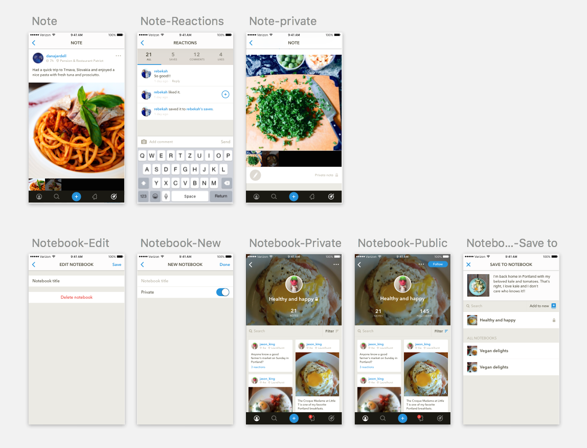
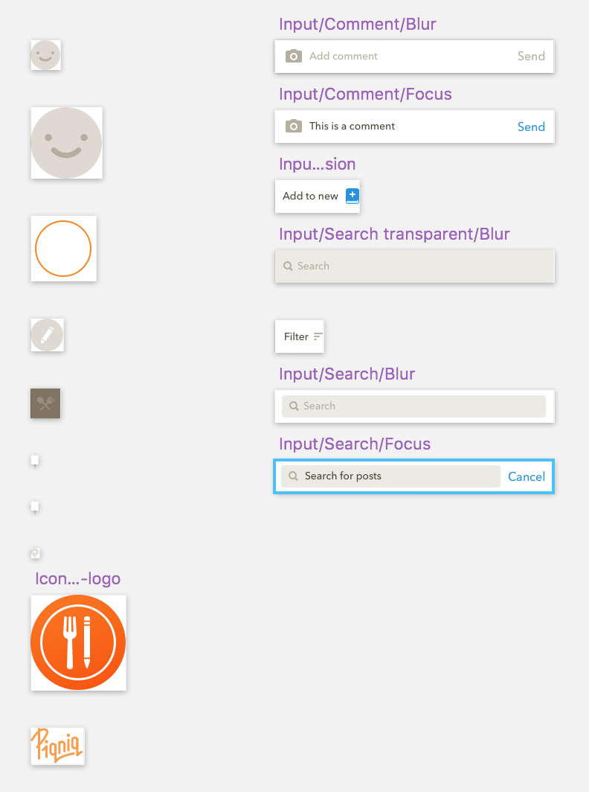

# sketch-align 0.4.0
Group and align your symbols and artboards by name

##Installation
Drop the .sketchplugin folder into your **Sketch plugins folder** (Plugins > Reveal Plugins Folder to find it).

##Align Artboards
Visually groups all layers(artboards) on a selected page based on the layer's name prefix.
Note: The plugin won't reorder the layers in the layer list to keep the process as fast as possible.

In the example below: the artboards with the same prefix (*'Note-'*, *'Notebook-'*) are aligned horizontally and a 200px padding is added under each row.

##Align Symbols
Visually groups all your symbols on the recently introduced 'Symbols' page based on the symbol's name and Sketch's default symbol foldering method. (You can organize your symbols to folders by including a slash “/” in their name.)
Based on the first folder name, the plugin visually organizes all your symbols to columns and adds an extra 200px right padding after each column.

